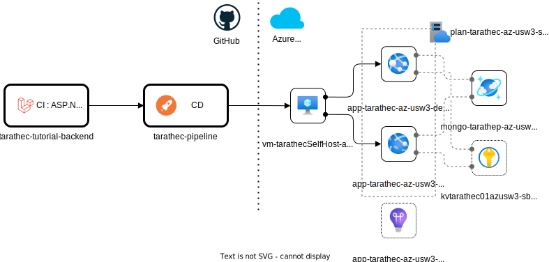

# CD Pipeline

Example repository continuous deployment (CD) pipeline for deployment applications to Azure Webapp

## Concept

CI/CD pipeline designed separate between CI repositories for build artifact and CD single repository for deploy Application to Cloud Azure resources such as azure app service (Web app, Static app, Function, … ), Azure Kubernetes service or configurations by communicate with Azure Spoke through self-host and compute on GitHub workflows.

## CI Dependencies

On this repository have dependencies with CI applications repositories for get artifact to deploy.

CI - Pipeline and Source Code
- https://github.com/tarathep/tarathec-tutorial-backend

## Resources on Azure Spoke

- rg-\<username>-az-usw3-sbx-001
  - plan-\<username>-az-usw3-sbx-001
  - app-\<username>-\<appname>-az-usw3-dev-001
  - app-\<username>-\<appname>-az-usw3-sit-001
  - vm-\<username>SelfHost-az-usw3-sbx-001
  - mongo-\<username>-az-usw3-sbx-001
  - kv\<username>01azusw3-sbx-001
